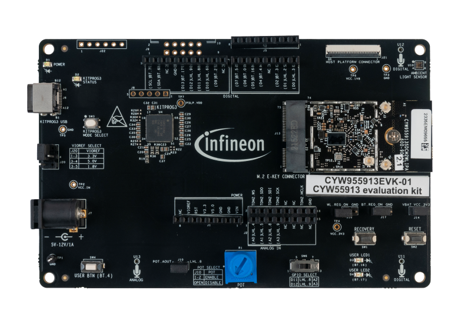

# CYW955913EVK-01 BSP

## Overview

The Infineon CYW55913 is ultra-lower power, single-chip, connected MCU that supports 1x1 Wi-Fi 6/6E,  Bluetooth® Low Energy 5.3, Matter, IP networking, with integrated PMU, targeted at Internet-of-Things (IoT) applications for stand-alone operation or to offload a host-processor. An integrated 192 MHz Arm® Cortex®-CM33,  runs the Wi-Fi and Networking Stacks, Bluetooth® LE 5.3 and supports a wide array of peripherals. 

To use code from the BSP, simply include a reference to `cybsp.h`.

## Features

### Kit Features:

* Arduino compatible headers for hardware expansion.
* On-board sensors - A Digital Ambient Light Sensor (TSL25403) and a Potentiometer.
* Two IFX PDM Microphone (IM69D130) and one Analog Microphone (IM73A135).
* User switches and LEDs
* USB Type-C connector for power, programming, and USB-UART bridge

### Kit Contents:

* CYW55913 Evaluation Board (CYW9CPM2BASE1 + CYW955913SDCM2WILPA)
* M.2 to FFC adapter board
* USB Type-C to Type-C cable
* 30-pin FFC cable 
* USB Type-C to Type-C cable
* Six jumper wires (5 inches each)
* Laird Triband PCB Antenna (2 Qty)
* Quick Start Guide

## BSP Configuration

The BSP has a few hooks that allow its behavior to be configured. Some of these items are enabled by default while others must be explicitly enabled. Items enabled by default are specified in the CYW955913EVK-01.mk file. The items that are enabled can be changed by creating a custom BSP or by editing the application makefile.

Components:
* Device specific category reference (e.g.: CAT1) - This component, enabled by default, pulls in any device specific code for this board.

Defines:
* CYBSP_WIFI_CAPABLE - This define, disabled by default, causes the BSP to initialize the interface to an onboard wireless chip if it has one.
* CY_USING_HAL - This define, enabled by default, specifies that the HAL is intended to be used by the application. This will cause the BSP to include the applicable header file and to initialize the system level drivers.
* CYBSP_CUSTOM_SYSCLK_PM_CALLBACK - This define, disabled by default, causes the BSP to skip registering its default SysClk Power Management callback, if any, and instead to invoke the application-defined function `cybsp_register_custom_sysclk_pm_callback` to register an application-specific callback.

See the [BSP Setttings][settings] for additional board specific configuration settings.

## API Reference Manual

The CYW955913EVK-01 Board Support Package provides a set of APIs to configure, initialize and use the board resources.

See the [BSP API Reference Manual][api] for the complete list of the provided interfaces.

## More information
* [CYW955913EVK-01 BSP API Reference Manual][api]
* [CYW955913EVK-01 Documentation](http://www.infineon.com/CYW955913EVK)
* [Cypress Semiconductor, an Infineon Technologies Company](http://www.cypress.com)
* [Infineon GitHub](https://github.com/infineon)
* [ModusToolbox™](https://www.cypress.com/products/modustoolbox-software-environment)

[api]: https://infineon.github.io/TARGET_CYW955913EVK-01/html/modules.html
[settings]: https://infineon.github.io/TARGET_CYW955913EVK-01/html/md_bsp_settings.html

---
© Cypress Semiconductor Corporation (an Infineon company) or an affiliate of Cypress Semiconductor Corporation, 2019-2025.